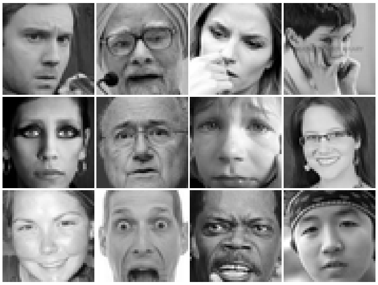
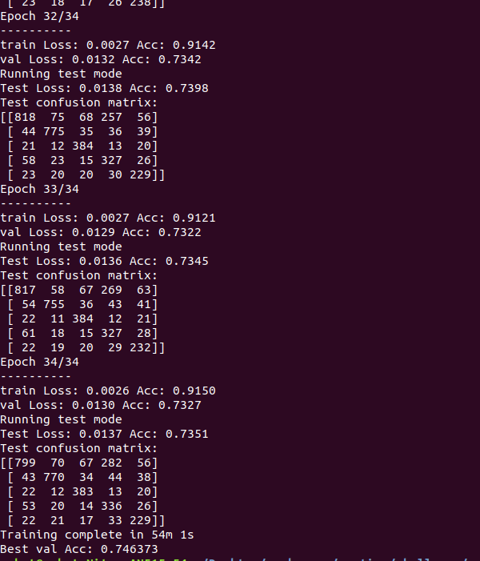
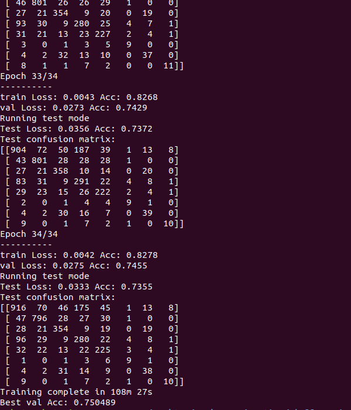

# Emotion Recognition

In this work my aim was to well define the problem of emotion recognition with corresponding metrics and develop a model for recognition with the receiving pipeline.

## Proposed solution

The architecture of proposed solution is illustrated below:


The image and the dynamic threshold are obtained from the Flask server, then image pre-processing techniques are applied to the image including the Viola-Jones algorithm for face detection. In case faces are found, they are resized, grayscaled and fed to the model for inference. Afterwards, all the required information like id of the face, probability of detection, emotion name, and the corresponding bounding boxes are stored in the database in the following manner:

```json
{
    "images": [
        {
            "file_name": "angry.jpeg",
            "threshold": 0.2,
            "faces": [
                {
                    "face_id": 1,
                    "anger": 0.94,
                    "bbox": [
                        "71",
                        "48",
                        "154",
                        "131"
                    ]
                }
            ]
        },
        {
            "file_name": "test.jpg",
            "threshold": 0.5,
            "faces": [
                {
                    "face_id": 1,
                    "happiness": 1.0,
                    "bbox": [
                        "109",
                        "160",
                        "192",
                        "243"
                    ]
                },
                {
                    "face_id": 2,
                    "sadness": 0.52,
                    "bbox": [
                        "207",
                        "157",
                        "290",
                        "240"
                    ]
                },
                {
                    "face_id": 3,
                    "bbox": [
                        "104",
                        "22",
                        "195",
                        "113"
                    ]
                }
            ]
        },
```

## Metrics

As it was mentioned, there are multiple steps during the recognition process that are required to quantify the quality of the proposed algorithm. First measurement can be defined as a number of total faces found on the image. As the problem definition mentioned that there may be more than one face in the image, it is required to find them all. The Viola-Jones (VJ) algorithm that is used for face detection have shown to be the best and the fastest solution for this problem and therefore was used. However, VJ is still prone to errors and may find some false positives during the recognition process. Therefore, the number of correctly identified faces and number/total number of faces in the image and number of false positives (hand found as a face) are first metrics that need to be monitored and are easy to detect/show/explain. 

After the training process, the most important metric is a quality of the emotion recognition by the convolutional neural network. The classical metrics for the classification task is also well defined and is based on the number of correctly classified data instances, which are images in our case. The accuracy for one class, let's say Anger is defined as a number of correctly classified Anger images divided by the total number of Anger images. The same applies to all classes. The total accuracy is defined as a number of all correctly classified images by the total number of images in the set (validation or testing). This metric again is maximally intuitive and should be easy to understand. 

Some additional metrics can be incorporated as well such as inference time to process one image, but it depend on the image passed by the server. Nevertheless, that should not be a problem in our case as Haar-Cascades (Viola-Jones) is very fast and the inference time for the model is also approximately constant, as the input dimensions given by the VJ are always the same. 

As it was shown above, there are some independent metrics for the emotion recognition task that can be quantitatively defined and are easy to explain and monitor. 

## Designed experiment workflow

### Available dataset

As it is the case for all machine learning problems, in order to develop a system that can classify an emotion of the person in the image, the dataset is required. Although one may have an idea to generate his or her own dataset for any problem, it is best first find available open-source dataset related to that problem and test the models. The more specific dataset can be then generated/gathered and trained on a pre-trained model.

The problem of Emotion Recognition also called as Facial Expression Recognition is well studied and multiple datasets for this task already exist. The most popular one is FER2013 introduced as a Kaggle Competition called Challenges in Representation Learning: Facial Expression Recognition Challenge [1]. Example of data is shown below:



However, the dataset contains some errors/incorrect naming in the labels and further work called FER+ was proposed where issues of labels were corrected [2]. In order to use it, authors developed a new database and scripts for file management in the FER dataset to convert it to the FER+. Example of differences for both datasets are shown below. Top label : FER2013; Bottom label : FER+


Moreover, the FER+ dataset contains additional data labels that may be useful for further deployment. The classes are: neutral, happiness, surprise, sadness, anger, disgust, fear, contempt, unknown, NF. Additionally, there is an available Vemo dataset, which was used for benchmarking the Facial Expression Recognition problem, but it is not available yet [3]. 

### Task Specific Dataset Generation

As it can be clearly seen, the training data includes only grayscale cropped faces of persons while input may be an RGB image with multiple persons with complex cluttered environment around them. This was the main reason for introduction of the Viola-Jones algorithm into the pipeline. As we can get similar processed image from any input, training can easily be done on the FER+ dataset with further generalization on other faces. Moreover, this also saves a lot computation time as the algotihm have to see only limited and relevant amount of pixels.

Afterwards, if one has a general idea of what kind of input is going to be fed into the network, like user average appearances (age, gender, race, color) and environment conditions (like the algorithm needs to operate in conditions of low light) can be used to create more task-specific dataset for training. Firstly, one have to gather as much different images of people and faces then can be then detected and cropped by the Viola-Jones algorithm. Furthermore, data labeling process is required, where data-labelers have to match each face with corresponding category. The categories have to be the same as in the initial dataset. Afterwards, the training can be done on a pre-trained model on the FER+ dataset and can be easily integrated for the further use.

### Training process

Moreover, the training process have to follow the best machine learning practices and conventions in order to create a robust model that can easily generalize to the unseen data. In order to see how model performs on unseen data, validation set is required. This is done by partitioning the training set data. In short,  the model is trained on the training data and validated on the validation data. Once the model’s performance on the validation set is satisfactory, it can be used for making predictions on the test data. Therefore, one should always keep track of the validation accuracy and loss so that the model does not overfit to the training data. This trade-off is necessary in order to create a robust model.

As it was mentioned training was conducted using the updated labels in the FER+ dataset. For the training process the VGG13 model (with pre-trained ImageNet weights) was used. It was trained on the FER+ dataset that can classify any face image into one of the 8 or 5 emotion categories. After training process for 5 and 8 classes for emotion recognition using the FER+ dataset, the validation accuracies have shown to be 74.6% and 75.0% (with more classes) accordingly.  




As the training process went on the cropped grayscale images of person faces, some preprocessing tecniques are required to be done. Firstly, images are acquired from the remote server using the RESTful API. Afterwards, the Viola-Jones face detection algorithm is applied to the images to find the faces in the image with corresponding bounding boxes and grayscaled using the OpenCV. Finally, detected faces are cropped and resized corresondingly with model input dimensions and fed to the model. The model then outputs class probabilities. The defined threshold from the server is used to output the results.

However, the inference time for the VGG_net was a little slow and was not runnning fast in real-time using the webcam, I decided to search for other solutions. I have found a good implementation [4] of the CNN network (let's call is Custom_net) and it performed much faster, but accuracy stated by its author was lower compared to the VGG_net. This was due to the fact that the pre-trained model on the RGB data was used, and it added an unnecessary complexity to the system In the final implementation of the pipelie, the Custom_net model was used.

### Networks comparison using defined metrics

- The metric of face detection is always the same for both my implementations as both of them depend on the same Viola-Jones algorithm.
- Both two models have similar accuracies, but the VGG_net have a higher number of classes which may help in case, higher number of classes is required for classification.
- The inference time for both networks was very different. The Custom_net has a very fast inference time and processes video input in real-time, but the VGG_net has a lag, and its processing time is much slower.

As it can be seen from the above mentioned metrics, there is no best solution and the selection of the model should always depend on the goals and expected results quantified by mentioned metrics. 

## Solution showcase

[https://youtu.be/BYBW-x5rILw](https://youtu.be/BYBW-x5rILw)

## Source code

[kurshakuz/emotion_recognition](https://github.com/kurshakuz/emotion_recognition)

## References:

[1] [https://www.kaggle.com/c/challenges-in-representation-learning-facial-expression-recognition-challenge/data](https://www.kaggle.com/c/challenges-in-representation-learning-facial-expression-recognition-challenge/data)

[2] [https://github.com/microsoft/FERPlus](https://github.com/microsoft/FERPlus)

[3] [https://github.com/phamquiluan/ResidualMaskingNetwork/issues/5](https://github.com/phamquiluan/ResidualMaskingNetwork/issues/5)

[4] [https://github.com/shangeth/Facial-Emotion-Recognition-PyTorch-ONNX](https://github.com/shangeth/Facial-Emotion-Recognition-PyTorch-ONNX)